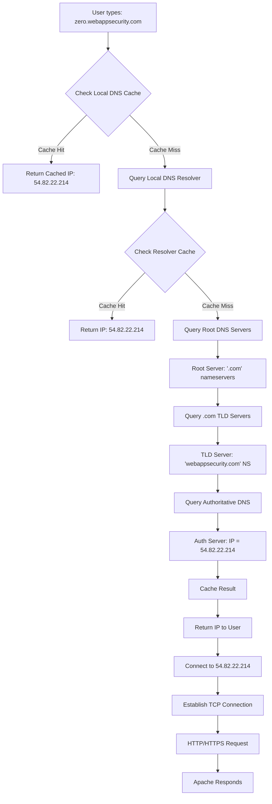

# DNS Investigation: Finding Real IP Addresses

[](https://github.com/yourusername/dns-investigation)
[](https://github.com/yourusername/dns-investigation)
[](https://github.com/yourusername/dns-investigation)

> 🔍 **Understanding how the internet finds websites through DNS resolution**

## 📋 Project Overview

This project demonstrates DNS resolution techniques and network reconnaissance using `nmap` and `dig` commands. We investigate how domain names are translated to IP addresses using **zero.webappsecurity.com** as our target.

### 🎯 Learning Objectives
- Understand DNS resolution process
- Learn network reconnaissance techniques
- Practice using `nmap` and `dig` tools
- Analyze DNS infrastructure and hosting details

## 🔧 Tools Used

| Tool | Purpose | Key Features |
|------|---------|--------------|
| `nmap -sL` | List scan for IP resolution | Hostname-to-IP mapping, reverse DNS |
| `dig` | DNS lookup utility | Detailed DNS records, query analysis |

## 📊 Investigation Results

### Target Analysis: zero.webappsecurity.com

```bash
# Basic IP resolution
$ nmap -sL zero.webappsecurity.com
Starting Nmap 7.80
Nmap scan report for zero.webappsecurity.com (54.82.22.214)
rDNS record for 54.82.22.214: ec2-54-82-22-214.compute-1.amazonaws.com

# DNS record lookup
$ dig zero.webappsecurity.com
; <<>> DiG 9.16.1 <<>> zero.webappsecurity.com
;; ANSWER SECTION:
zero.webappsecurity.com. 300 IN A 54.82.22.214
```

### 🌐 Key Findings

| Attribute | Value |
|-----------|-------|
| **Primary IP** | `54.82.22.214` |
| **Reverse DNS** | `ec2-54-82-22-214.compute-1.amazonaws.com` |
| **Hosting Provider** | Amazon Web Services (AWS) |
| **Region** | US East (Virginia) |
| **Web Server** | Apache |
| **Open Ports** | 80 (HTTP), 443 (HTTPS) |

## 🔄 DNS Resolution Flow



## 💻 Command Reference

### Basic Commands

```bash
# Get IP address with reverse DNS lookup
nmap -sL zero.webappsecurity.com

# Basic DNS query
dig zero.webappsecurity.com

# Get specific record types
dig zero.webappsecurity.com A      # IPv4 address
dig zero.webappsecurity.com AAAA   # IPv6 address  
dig zero.webappsecurity.com MX     # Mail exchange
dig zero.webappsecurity.com NS     # Name servers
```

### Advanced Techniques

```bash
# Trace full DNS resolution path
dig +trace zero.webappsecurity.com

# Use specific DNS server (Google's)
dig @8.8.8.8 zero.webappsecurity.com

# Short format output
dig +short zero.webappsecurity.com

# Get all available records
dig zero.webappsecurity.com ANY

# Reverse DNS lookup
dig -x 54.82.22.214
```

## 🛡️ Security Context

> ⚠️ **Important**: zero.webappsecurity.com is a **legitimate security testing platform** created by Micro Focus Fortify for educational purposes.

### What This Domain Is:
- ✅ Educational security testing platform
- ✅ Web application vulnerability demonstrations  
- ✅ Safe environment for learning
- ✅ Used for WebInspect product testing

### What This Domain Is NOT:
- ❌ Real banking website
- ❌ Production system
- ❌ Unauthorized target

## 🔍 Network Reconnaissance Value

Understanding DNS resolution helps with:

1. **🎯 Asset Discovery**
   - Finding all IPs associated with a domain
   - Discovering subdomains and services

2. **🗺️ Infrastructure Mapping**
   - Identifying hosting providers
   - Understanding network topology

3. **🔒 Security Assessment**
   - Analyzing DNS configuration security
   - Identifying potential vulnerabilities

4. **📈 Attack Surface Analysis**
   - Mapping external-facing services
   - Understanding organizational infrastructure

## 📚 What Each Tool Reveals

### `nmap -sL` (List Scan)
- **Purpose**: Resolve hostnames without port scanning
- **Speed**: Very fast, no network intrusion
- **Output**: IP addresses and reverse DNS records
- **Use Case**: Quick IP resolution and infrastructure identification

### `dig` (Domain Information Groper)
- **Purpose**: Comprehensive DNS record analysis
- **Detail Level**: High - shows TTL, query times, record types
- **Flexibility**: Can query specific record types and DNS servers
- **Use Case**: Detailed DNS investigation and troubleshooting
